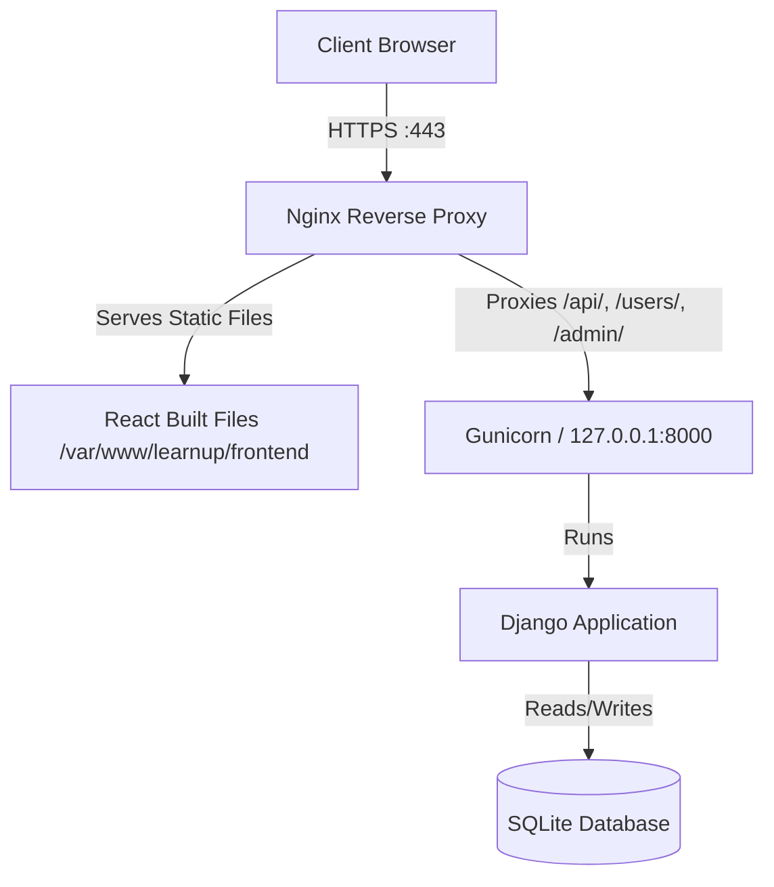

# Deployment Guide: AWS Lightsail

This guide provides step-by-step instructions to deploy your **Django Backend** and **React (Vite) Frontend** on a single **AWS Lightsail Ubuntu Instance**.

We will use a production-grade setup featuring:
*   **Gunicorn**: WSGI server to run Django.
*   **Systemd**: Process manager to keep Gunicorn running in the background.
*   **Nginx**: Reverse proxy and web server to route traffic, serve React static files, and serve Django static files.
*   **SSL (Let's Encrypt)**: Secure HTTPS connection.

---

## Architecture Overview



---

## Phase 1: Local Code Preparation

Before deploying, we need to prepare the codebase for a production environment.

### 1. Backend Prep

#### A. Verify `requirements.txt`
Since you already have a `requirements.txt` file, you do not need to regenerate it. However, please ensure that **`gunicorn`** and **`django-cors-headers`** are listed in it. If they are not, add them to your `requirements.txt` so the server installs them correctly.

#### B. Push Code to GitHub
Before proceeding to setup the Lightsail instance, push your latest local changes to your GitHub repository:
```bash
# Verify you are in the project root
git add .
git commit -m "Prepare codebase for production deployment"
git push origin main
```

#### C. Update Django `settings.py`
In [settings.py](file:///Users/mohammadshahrukh/learnup/backend/learnup/learnup/settings.py), update the configuration to handle production environments securely:

```python
# settings.py

# 1. Disable Debug mode in production
DEBUG = False

# 2. Allow requests from your domain and static IP
ALLOWED_HOSTS = ['learnupofficial.com', 'www.learnupofficial.com', 'YOUR_LIGHTSAIL_STATIC_IP']

# 3. Configure Static Files Root
STATIC_ROOT = BASE_DIR / 'staticfiles'

# 4. CORS and CSRF Settings
CORS_ALLOWED_ORIGINS = [
    'https://learnupofficial.com',
    'https://www.learnupofficial.com',
]

CSRF_TRUSTED_ORIGINS = [
    'https://learnupofficial.com',
    'https://www.learnupofficial.com',
]
```


### 2. Frontend Prep

We want to avoid hardcoding `localhost:8000` in production. Update your API service to use a dynamic backend URL.

#### A. Edit Vite Configuration
Check [api.js](file:///Users/mohammadshahrukh/learnup/frontend/learnup/src/services/api.js). Instead of a hardcoded URL:
```javascript
const API_BASE_URL = 'http://localhost:8000';
```
Change it to dynamically reference your domain or use relative paths (recommended if using Nginx routing, as it avoids CORS issues completely):
```javascript
// Dynamic configuration using environment variables or fallback to relative paths
const API_BASE_URL = import.meta.env.VITE_API_URL || '';
```
Using an empty string `''` makes API requests relative (e.g. `fetch('/api/chat/')`), meaning the browser sends requests directly to the same host/port serving the frontend (Nginx), which then routes it to the backend internally.

#### B. Build Check
Ensure the frontend builds without errors locally:
```bash
cd frontend/learnup
npm install
npm run build
```
This generates a `dist/` folder containing the static HTML, CSS, and JS assets.

---

## Phase 2: AWS Lightsail Setup

### 1. Launch a New Instance
1. Log in to the [AWS Lightsail Console](https://lightsail.aws.amazon.com/).
2. Click **Create instance**.
3. Choose the instance location (pick the region closest to your users).
4. Select your platform: **Linux/Unix**.
5. Select a blueprint: **OS Only** -> **Ubuntu 22.04 LTS** (or 24.04 LTS).
6. Choose your instance plan (the $3.50/month or $5/month tier is excellent for starting).
7. Name your instance (e.g., `learnup-server`).
8. Click **Create instance**.

### 2. Attach a Static IP
By default, the public IP of your instance will change if it restarts. Let's make it permanent:
1. Navigate to the **Networking** tab in Lightsail.
2. Click **Create static IP**.
3. Choose your instance (`learnup-server`) to attach it.
4. Name it and click **Create**. Note down this static IP address.

### 3. Configure the Firewall
Ensure the ports for web traffic are open:
1. Go to your instance page and click the **Networking** tab.
2. Under **IPv4 Firewall**, click **Add rule**.
3. Ensure the following rules are present:
   *   **SSH** (Port 22) - Restrict source IP if possible for security.
   *   **HTTP** (Port 80) - Open to All.
   *   **HTTPS** (Port 443) - Open to All.

---

## Phase 3: Server Configuration (via SSH)

Connect to your instance via the web-based SSH client in the Lightsail Console, or use your local terminal:
```bash
ssh -i /path/to/your-lightsail-key.pem ubuntu@YOUR_LIGHTSAIL_STATIC_IP
```

Once logged in, perform the following steps:

### 1. Update Packages and Install Dependencies
```bash
sudo apt update && sudo apt upgrade -y
sudo apt install -y python3-pip python3-venv nginx git curl
```

### 2. Clone Your Codebase
We will place the application in `/var/www/learnup`:
```bash
sudo mkdir -p /var/www/learnup
sudo chown -R ubuntu:ubuntu /var/www/learnup
cd /var/www/learnup

# Clone your repository (or copy your files using SCP/SFTP)
git clone https://github.com/your-username/learnup.git .
```

### 3. Backend Setup

#### A. Virtual Environment & Dependencies
```bash
cd /var/www/learnup/backend/learnup
python3 -m venv env
source env/bin/activate
pip install -r requirements.txt
pip install gunicorn
```

#### B. Setup Environment Variables
Create your production `.env` file:
```bash
nano .env
```
Add your production keys:
```env
GEMINI_API_KEY=your_actual_gemini_api_key
OPENAI_API_KEY=your_actual_openai_api_key
RAZORPAY_KEY_ID=your_actual_razorpay_key_id
RAZORPAY_KEY_SECRET=your_actual_razorpay_key_secret
# Generate a secure Django Secret Key for production
SECRET_KEY=generate_a_long_random_string_here
```
Press `Ctrl+O` then `Enter` to save, and `Ctrl+X` to exit nano.

#### C. Run Database Migrations & Collect Static Files
```bash
python manage.py migrate
python manage.py collectstatic --noinput
```
*(This creates the staticfiles directory under `/var/www/learnup/backend/learnup/staticfiles` containing Django Admin CSS/JS)*

---

## Phase 4: Setting up Gunicorn (Process Manager)

We want Gunicorn to run Django in the background and auto-start if the server reboots.

### 1. Create a Systemd Service File
```bash
sudo nano /etc/systemd/system/gunicorn.service
```

Add the following configuration:
```ini
[Unit]
Description=gunicorn daemon
After=network.target

[Service]
User=ubuntu
Group=www-data
WorkingDirectory=/var/www/learnup/backend/learnup
ExecStart=/var/www/learnup/backend/learnup/env/bin/gunicorn \
          --access-logfile - \
          --workers 3 \
          --bind 127.0.0.1:8000 \
          learnup.wsgi:application

[Install]
WantedBy=multi-user.target
```

### 2. Start and Enable Gunicorn
```bash
sudo systemctl start gunicorn
sudo systemctl enable gunicorn
```

To verify that Gunicorn is running successfully:
```bash
sudo systemctl status gunicorn
```

---

## Phase 5: Frontend Deployment & Nginx Configuration

### 1. Build the React Frontend
You can build the frontend directly on the server:
```bash
cd /var/www/learnup/frontend/learnup
npm install

# Create production env variables if needed
echo "VITE_API_URL=" > .env.production # Empty string routes via Nginx proxy relative path

npm run build
```
*(This creates `/var/www/learnup/frontend/learnup/dist` containing your static frontend).*

### 2. Configure Nginx
Create an Nginx configuration file for your app:
```bash
sudo nano /etc/nginx/sites-available/learnup
```

Paste the following configuration (replace `learnupofficial.com` with your actual domain name or static IP):
```nginx
server {
    listen 80;
    server_name learnupofficial.com www.learnupofficial.com YOUR_LIGHTSAIL_STATIC_IP;

    # Frontend React App Static Files
    location / {
        root /var/www/learnup/frontend/learnup/dist;
        index index.html;
        try_files $uri $uri/ /index.html;
    }

    # Django Admin / API reverse proxy
    location ~ ^/(api|users|admin) {
        proxy_pass http://127.0.0.1:8000;
        proxy_set_header Host $host;
        proxy_set_header X-Real-IP $remote_addr;
        proxy_set_header X-Forwarded-For $proxy_add_x_forwarded_for;
        proxy_set_header X-Forwarded-Proto $scheme;
    }

    # Django Admin Static Files
    location /static/ {
        alias /var/www/learnup/backend/learnup/staticfiles/;
    }

    # Optional: Cache control for static assets
    location ~* \.(?:css|js|jpg|jpeg|gif|png|ico|cur|gz|svg|svgz|mp4|ogg|ogv|webm|htc)$ {
        root /var/www/learnup/frontend/learnup/dist;
        expires 1M;
        access_log off;
        add_header Cache-Control "public";
    }
}
```

### 3. Enable Nginx Config and Restart
Disable the default configuration, link your new config, and restart Nginx:
```bash
sudo rm /etc/nginx/sites-enabled/default
sudo ln -s /etc/nginx/sites-available/learnup /etc/nginx/sites-enabled/
sudo nginx -t # Verify there are no syntax errors
sudo systemctl restart nginx
```

---

## Phase 6: Securing with SSL (HTTPS)

Let's encrypt our connection using standard free certificates from **Let's Encrypt** via **Certbot**.

*(Note: You must have a domain name pointed at your Lightsail Static IP using A records in DNS settings for this to work).*

### 1. Install Certbot
```bash
sudo apt install snapd -y
sudo snap install core; sudo snap refresh core
sudo snap install --classic certbot
sudo ln -s /snap/bin/certbot /usr/bin/certbot
```

### 2. Generate SSL Certificate
Run Certbot and follow the prompts:
```bash
sudo certbot --nginx -d learnupofficial.com -d www.learnupofficial.com
```
Certbot will automatically verify ownership, fetch the certificate, and update the Nginx configuration to enable HTTPS redirecting.

### 3. Verify Auto-Renewal
Let's Encrypt certificates last for 90 days. Certbot installs a systemd timer to renew them automatically. Verify renewal is working:
```bash
sudo certbot renew --dry-run
```

---

## Phase 7: Post-Deployment Steps

1. **Database Seeding**:
   If you have seed scripts (like `seed_products.py`), run them using the server's virtual environment:
   ```bash
   cd /var/www/learnup/backend/learnup
   source env/bin/activate
   python seed_products.py
   ```
2. **Logs Monitoring**:
   If anything goes wrong, you can check the server logs:
   *   **Gunicorn logs**: `sudo journalctl -u gunicorn -f`
   *   **Nginx access logs**: `sudo tail -f /var/log/nginx/access.log`
   *   **Nginx error logs**: `sudo tail -f /var/log/nginx/error.log`
